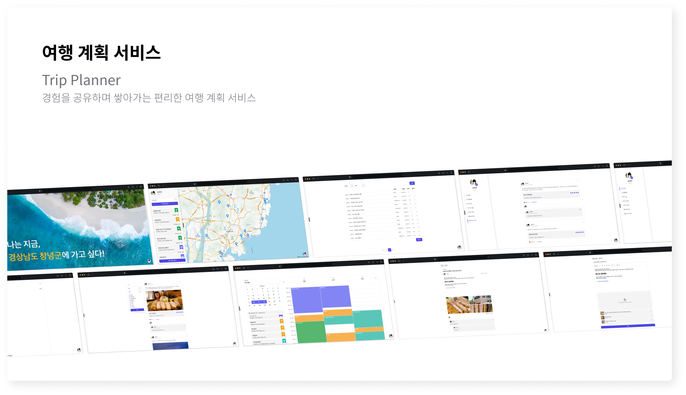
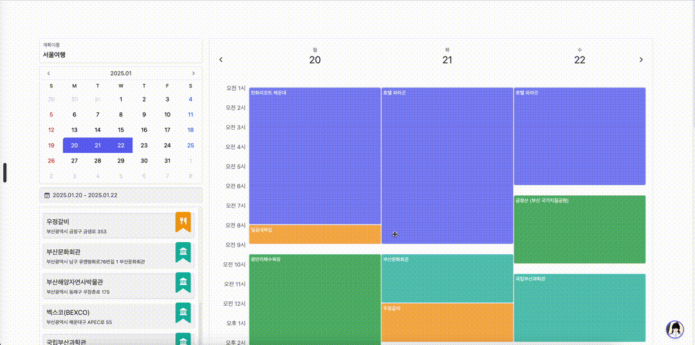
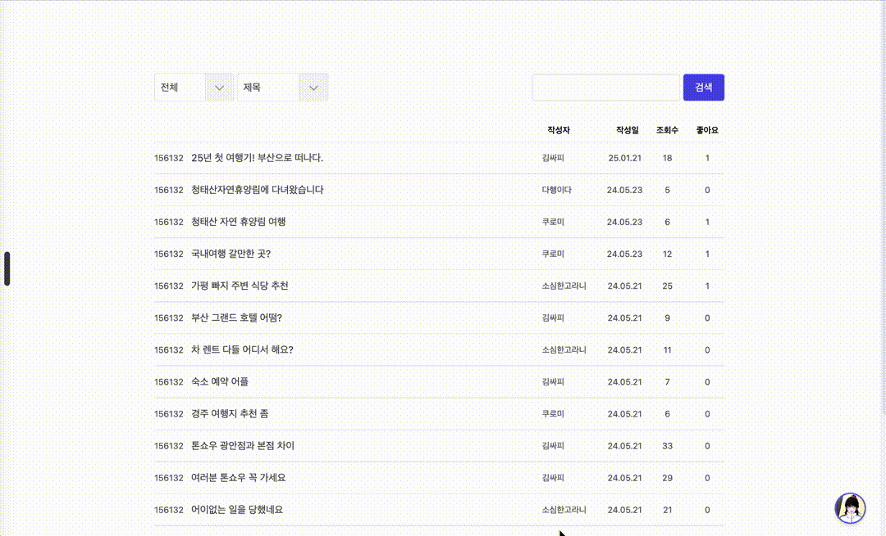

# Trip Planner

경험을 공유하며 쌓아가는 편리한 여행 계획 서비스

## 목차

1. [프로젝트 정보](#1-프로젝트-정보)
2. [서비스 소개](#2-서비스-소개)
3. [핵심 기능 및 구현 과정](#3-핵심-기능-및-구현-과정)
4. [배운점 및 인사이트](#4-배운점-및-인사이트)

## 1. [프로젝트 정보](#목차)

#### 1.1 프로젝트명

- Trip Planner

#### 1.2 프로젝트 소개

- Trip Planner는 서로 경험을 공유하며 쌓아가고, 이를 토대로 자신만의 여행 계획을 세울 수 있는 서비스입니다.
- 국내 주요 관광지를 한 번에 찾아보고, 각 관광지에 대한 사용자들의 생생한 리뷰를 모아 확인할 수 있습니다.
- 시간대별로 상세한 여행 계획을 세우고, 각 여행지에 대한 경험을 공유할 수 있습니다.

#### 1.3 프로젝트 기간

- 2024.05.16 ~ 2024.05.23 (2주)

#### 1.4 프로젝트 인원

- [황세웅](https://github.com/pokycookie): 프론트엔드 개발 총괄, 팀장
- [김강진](https://github.com/nurdy-kim): 백엔드 개발 총괄

#### 1.5 프로젝트 성과

- 삼성 청년 SW 아카데미 11기 1학기 프로젝트 경진대회 최우수상 수상 (2024.05.24)
- Vue 생태계를 탐구하고, 컴포넌트 개발 및 상태 관리에 대한 깊은 이해를 확보
- 백엔드 개발자와의 협업을 통한 API 설계 및 데이터 통신 흐름에 대한 경험

#### 1.6 프로젝트 기술스택

- 프론트엔드: `TypeScript`, `Vue`, `Pinia`, `Tailwind CSS`
- 백엔드: `Java`, `Spring Boot`, `JPA`, `Query DSL`, `MySQL`
- 협업 및 개발 툴: `Jira`, `Github`

##### 1.6.1 TypeScript

- 개발 단계에서 타입 오류를 발견하여 런타임 에러를 사전에 방지하고자 했습니다.
- 코드 자동 완성과 타입 추론 기능을 통해 개발 생산성을 크게 향상시킬 수 있었습니다.
- 컴포넌트의 `props`와 `emits`에 타입을 명시하여, 각 컴포넌트 사용에 대한 명확한 의도를 드러낼 수 있었습니다.

##### 1.6.2 Vue

- 프로젝트 요구 사항에 부합하는 컴포넌트 기반의 아키텍처를 제공합니다.
- 비교적 낮은 학습 곡선으로 2주라는 짧은 개발 기간 동안 빠른 습득 및 개발이 가능했습니다.

##### 1.6.3 Pinia

- Vuex와 달리 복잡한 mutation/action 패턴 없이 직관적인 상태 관리가 가능했습니다.
- TypeScript와의 통합이 우수하여 전역 상태에 대한 타입 안정성을 확보할 수 있었습니다.
- JWT 기반 인증, 알림 메시지, 여행지 상태 관리 등 앱 전반에 걸친 상태 관리에 활용했습니다.

##### 1.6.4 Tailwind CSS

- 유틸리티 클래스 기반으로 일관된 디자인 시스템을 빠르게 구축할 수 있었습니다.
- 인라인 스타일링 방식을 사용하여, 별도의 스타일시트 없이 하나의 컴포넌트 내에 로직, 구조, 스타일을 모두 정의하여 관리할 수 있었습니다.
- 반응형 디자인을 손쉽게 구현할 수 있어 다양한 화면 크기에 대응하는 UI를 효과적으로 개발했습니다.

## 2. [서비스 소개](#목차)

### 2.1 국내 관광지 둘러보기

국내 주요 관광지 정보를 한눈에 확인할 수 있습니다.

- 무한스크롤로 관광지 정보를 계속 스크롤하여 확인할 수 있습니다.
- 지역별, 테마별로 관광지를 필터링하여 원하는 관광지를 쉽게 찾을 수 있습니다.
- 각 관광지에 대한 상세 정보와 함께 사용자들의 리뷰와 평점을 한 번에 모아 확인할 수 있습니다.

### 2.2 여행 경험 공유하기

사용자들은 자신의 여행 경험을 리뷰 형태로 공유할 수 있습니다.

- 방문한 관광지에 대한 리뷰를 사진과 함께 작성하여 다른 사용자들과 정보를 공유할 수 있습니다.
- 각 관광지에 대한 별점을 남길 수 있고, 이는 모두 모여 해당 관광지에 대한 평균 별점이 됩니다.
- 다른 사용자들은 리뷰에 댓글을 남기거나, 대댓글을 남겨 자유롭게 의견을 공유할 수 있습니다.

### 2.3 세부 계획 세우기

Trip Planner의 핵심 기능인 세부 계획 세우기 기능은 직관적인 드래그 앤 드롭 방식으로 시간대별로 상세한 일정을 계획할 수 있습니다.

- 내 계획에 추가된 관광지들을 드래그 앤 드롭 방식으로 일정에 추가할 수 있습니다.
- 추가된 일정을 자유롭게 옮기고, 시간대를 조절하고, 밖으로 끌어 계획에서 제거할 수 있습니다.
- 완성된 여행 계획을 시간순으로 정렬된 일정표로 한눈에 확인할 수 있습니다.

### 2.4 자유게시판으로 자유롭게 소통하기

자유게시판을 통해 여행 관련 정보를 공유하고 질문할 수 있습니다.
여행 꿀팁 공유, 여행 관련 질문 등 다양한 주제로 소통할 수 있는 공간을 제공합니다.

- 전용 에디터를 제공하여, 글씨 크기, 굵게, 기울임, 밑줄과 같은 다양한 서식을 제공합니다.
- 드래그 앤 드롭 또는 파일을 선택하는 방식으로 필요한 이미지 파일을 자유롭게 업로드할 수 있습니다.
- 다른 사용자들도 글에 댓글을 남기거나, 대댓글을 남겨 자유롭게 소통할 수 있습니다.

### 2.5 마이페이지에서 내 정보 모아보기

마이페이지에서는 프로필과 여행계획 그리고 사용자의 모든 활동 내역(게시글, 리뷰, 댓글, 좋아요 한 게시글 및 리뷰 등)을 한눈에 확인할 수 있습니다.

- 프로필 탭에서 닉네임, 전화번호, 비밀번호를 포함한 개인정보를 변경할 수 있습니다.
- 내 여행계획 탭에서 이전에 세웠던 여행 기록을 살펴보고, 여행했던 관광지에 대한 리뷰를 남길 수 있습니다.
- 작성한 게시글, 리뷰, 댓글, 좋아요한 게시글 및 리뷰 등 기타 활동 내역을 확인할 수 있습니다.

## 3. [핵심 기능 및 구현 과정](#목차)

### 3.1 각 시스템 사이의 높은 연동성

Trip Planner의 중요한 특징 중 하나는 관광지 정보, 리뷰 정보, 여행 계획, 심지어 지도까지 각 시스템 사이의 긴밀한 연동입니다.

사용자는 관광지 정보에서 관련 리뷰를 한 번에 모아 확인할 수 있고, 반대로 각 리뷰에서 해당하는 관광지 정보로 바로 이동할 수 있습니다.
또한 마음에 드는 관광지를 발견하면 언제든 자신의 여행 계획에 추가할 수 있으며, 이렇게 추가된 정보는 실시간으로 지도에 연동됩니다.

이러한 연동성을 구현하기 위해 다음과 같은 기술을 적용했습니다.

#### 3.1.1 URL 쿼리 파라미터

- 관광지 페이지와 리뷰 페이지에서 필터링 조건을 **URL 쿼리 파라미터**로 관리하여, 페이지 새로고침에도 필터링 상태가 유지되도록 했습니다.
- 관광지에서 리뷰로, 리뷰에서 관광지로 쉽게 이동할 수 있도록, **URL 쿼리 파라미터를 활용한 링크 시스템**을 구축했습니다.

#### 3.1.2 전역 상태 관리

- 전역 상태 관리 라이브러리인 **Pinia**를 활용하여, 애플리케이션 어디에서든 사용자가 현재 선택한 여행 계획에 대한 상태값에 접근할 수 있도록 설계하였습니다.
- 마음에 드는 관광지를 여행 계획에 추가하면 이를 **전역으로 관리**하여, 여행 계획 세우기 페이지와 지도 페이지에서 선택된 여행 정보를 바로 확인할 수 있도록 하였습니다.

### 3.2 드래그 앤 드롭 방식의 일정 계획 시스템

프로젝트의 가장 핵심적인 기능으로, 사용자가 직관적으로 여행 일정을 계획할 수 있는 드래그 앤 드롭 인터페이스를 직접 구현했습니다.
이 기능은 사용자들이 직관적으로 여행 계획을 세울 수 있도록 하여 프로젝트의 차별화 포인트가 되었습니다.

해당 기능을 구현하기 위해 다음과 같은 기술적 과제를 해결했습니다.

#### 3.2.1 마우스 이벤트 처리

- `mousedown`, `mousemove`, `mouseup`, `mouseenter` 와 같은 마우스 이벤트를 세밀하게 제어하여 드래그 시작, 이동, 종료 시점을 정확히 파악하고 처리했습니다.
- 드래그 앤 드롭을 위한 `Pinia` 전역 상태 관리 스토어를 두어 드래그와 리사이징 관련 처리를 관리할 수 있도록 했습니다.

#### 3.2.2 좌표값 실시간 계산 및 매핑

- 마우스 좌표를 시간 그리드에 매핑하여 정확한 시간대에 일정이 배치되도록 했습니다.
- 날짜 차이에 따른 `offsetX`와 시간 차이에 따른 `offsetY`를 계산하고, 시간 차이를 30분 단위로 환산하여 `height`을 계산했습니다.

#### 3.2.3 반응형 그리드 시스템

- 컨테이너의 너비와 표시할 날짜 수를 기반으로 각 날짜 열의 너비를 계산합니다.
- 각 그리드 셀마다 마우스 이벤트 핸들러를 배치하여 드래그가 끝나는 지점의 인덱스를 기준으로 위치 변경, 크기 변경 등의 작업이 동작하도록 했습니다.
- `resize` 이벤트를 사용하여, 브라우저 화면 크기가 변경되어도 그리드와 일정 블록의 비율이 유지되도록 구현했습니다.

### 3.3 체계적인 라우팅 관리

Vue Router를 활용하여 효율적인 라우팅 시스템을 구축했습니다.

페이지 전환 시 인증이 필요한 페이지의 접근을 제어하고, 불필요한 렌더링을 줄이며, 부드러운 애니메이션을 유지하는 등 더 나은 사용자 경험을 제공할 수 있었습니다.

#### 3.3.1 공통 레이아웃 및 중첩 라우팅

- 네비게이션 바, 알림, 모달 창 등 애플리케이션 전반에서 사용되는 공통 요소를 라우터 바깥에 배치하여 페이지 전환 시 불필요한 재렌더링을 방지했습니다.
- 마이페이지와 같은 계층화된 구조에서 중첩 라우팅을 활용하여 사이드바는 유지한 채 내용만 변경되도록 구현했습니다.
- 이처럼 한 화면에서 변경되는 영역과 변경되지 않는 부분을 철저히 분리하여, 불필요한 재렌더링을 방지하고 부드러운 애니메이션이 이어지도록 했습니다.

#### 3.3.2 라우트 가드와 동적 **라우팅**

- `beforeEnter` 가드를 활용하여 인증이 필요한 페이지에 대한 접근 제어를 구현했습니다.
- `/plans/:id`와 같은 동적 라우팅을 활용하여 상세 페이지를 효율적으로 관리했습니다.

## 4. [배운점 및 인사이트](#목차)

### 4.1 백엔드와의 협업의 어려움

이번 프로젝트에서 백엔드 팀원과 함께 각자의 위치에서 협업하며 개발하는 과정에서, 생각지 못한 여러 방면에서 다양한 어려움을 겪었습니다.
개발 당시에는 적절한 해결책을 찾지 못해 어려움을 겪었지만,
프로젝트가 끝나고 이를 다시 돌아보며 이후 같은 상황이 오더라도 더 유연하고 좋은 방법으로 대처할 수 있는 경험치를 쌓을 수 있었습니다.

#### 4.1.1 준비되지 않은 API

- 백엔드에서 관련 API가 개발되지 않은 경우, 프론트엔드 입장에서는 해당 기능이 완성될 때까지 다른 부분을 개발하며 **기다려야 하는 문제**가 발생합니다.
- 백엔드측의 문제가 없다고 하더라도, **특정 응답 상황에서의 레이아웃**을 확인하기 위해서는 **실제 데이터**를 필요한 형태로 **실제 서버에 준비**시켜 놓아야 하는 문제가 있습니다.
- 이러한 문제를 경험하며, 프론트엔드 개발 과정에서 **백엔드에 의존하지 않도록** 하기 위해 **API Mocking**의 중요성을 느꼈습니다.

#### 4.1.2 원활하지 않은 소통

- 프론트엔드와 백엔드 개발자가 각자의 작업에 집중하다 보니, API 변경 사항에 대한 **소통이 원활하지 않은 경우**가 있었습니다.
- 정기적으로 소통하는 시간을 가져, 각자의 상황을 공유하고 변경 사항에 대해 **즉시 공유하는 체계**를 갖추는 것의 중요성을 느꼈습니다.
- 또한 단순히 소통을 규칙으로 두는 것을 넘어, `Swagger`와 같이 실제 백엔드 코드가 자동으로 문서화되는 일종의 **시스템**을 구축하는 것의 중요성을 알았습니다.

#### 4.1.3 수시로 변경되는 API 명세

- 개발 과정에서 API 명세가 변경되는 일이 잦았는데, 이때마다 프론트엔드 코드를 **지속적으로 수정**해야 했습니다.
- 특히 컴포넌트 내부에서 `axios`를 사용해 직접 데이터를 패칭하는 방식을 사용했기에, 관련된 모든 컴포넌트를 일일이 수정해야 하는 번거로움이 있었습니다.
- 이를 통해 데이터 패칭이라는 **관심사**를 컴포넌트에서 **분리**하여, **유지보수** 측면에서의 설계를 견고히 하는 것의 중요성을 깨달았습니다.

### 4.2 새로운 개발 조건에서의 적응

이번 프로젝트를 진행한 '삼성 청년 SW 아카데미 1학기 프로젝트 경진대회'에서는 프론트엔드 개발 프레임워크로 반드시 `Vue`를 사용해야 했습니다.
기존에 `React`를 주력으로 개발해 오던 저에게는 어려운 조건이었지만, 이를 적응하고 과제를 해내는 과정에서 새로운 인사이트를 얻을 수 있었습니다.

실제 실무에서는 여러 이유로 기존에 사용하던 개발 방식을 사용하지 못할 가능성이 있습니다.
이번 프로젝트에서 이와 유사한 상황을 직접 경험하면서, 새로운 환경에 어떻게 대처해야 할지, 평소에 어떻게 대비해야 할지 고민해 볼 수 있었습니다.

#### 4.2.1 처음 경험한 Vue 개발

- `Vue`라는 새로운 프레임워크에 빠르게 적응하기 위해, 기존에 이미 알고 있던 `React`의 요소 하나하나에 대응시키며 동일한 부분, 차이가 있는 부분 등을 찾아나갔고, 이를 문서화하여 정리하였습니다.
- 대부분의 새로운 기술이 기존의 기술과 같은 개념을 상당수 공유한다는 것을 적극 활용하여, 기존에 잘 알고 있던 기술과 비교하는 방식으로 새로운 기술을 빠르게 습득할 수 있었습니다.
- 다양한 분야에서 대표되는 기술들을 하나씩이라도 알아둔다면, 이후 비슷한 개념의 새로운 기술이 등장하더라도 빠르게 적응하고 실무에 활용할 수 있을 것이라는 확신을 가지게 되었습니다.

#### 4.2.2 대부분의 컴포넌트 직접 개발

- `Vue`의 경우 `React`에 비해 라이브러리 생태계가 비교적 작았기 때문에, 필요한 컴포넌트 대부분을 직접 개발해야 했습니다.
- 이 과정에서 라이브러리로 흔히 사용하는 컴포넌트들이 내부적으로 어떻게 동작하는지에 대한 고심을 할 수 있었고, 특히 사용자 입력 이벤트 처리에 대한 깊은 경험을 쌓을 수 있었습니다.
- 필요한 컴포넌트들을 직접 구현한 결과, 각 컴포넌트 간 UI/UX 통일성을 높이고, 프로젝트에 딱 필요한 형태로 기능을 제작할 수 있었습니다.
- 실무에서는 개발 시간 단축과 높은 신뢰도를 위해 외부 라이브러리를 활용하는 경우가 많을 수 있지만, 이렇게 직접 컴포넌트들을 구현한 경험은 향후 프로젝트에 꼭 맞는 커스텀 컴포넌트를 개발하거나, 기존 라이브러리의 동작 원리를 이해하고 활용해야 할 때 큰 도움이 될 것입니다.
